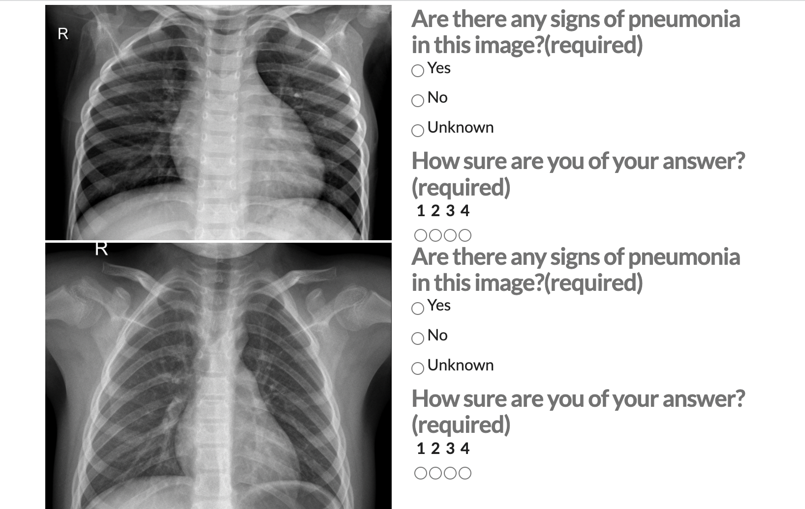

# AI Product Manager Nanodegree

## Project n° 1: Create a Medical Image Annotation Job

**Purpose:**  

Build a product that helps doctors quickly identify cases of pneumonia in children. 

**Output:**
- Created a data labeling job using Appen's platform. 
- Developed a proposal file, which is a writeup that details my design considerations and strategies for quality assurance.

