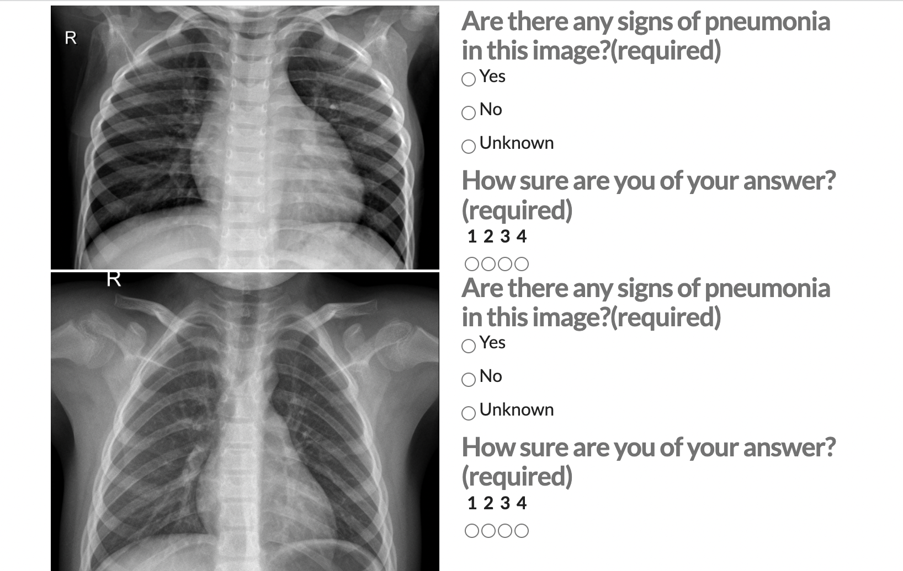

# AI Product Manager Nanodegree

## [Project n°1: Medical Image Annotation Job](https://github.com/elateifsara/ai-product-management/tree/main/project1)

**Purpose:**  

Build a product that helps doctors quickly identify cases of pneumonia in children. 

**Output:**
- Created a data labeling job using Appen's platform. 
- Developed a proposal file, which is a writeup that details my design considerations and strategies for quality assurance.

## [Project n°2: Model with Google AutoML](https://github.com/elateifsara/ai-product-management/tree/main/project2)

**Purpose:** 
Study how training data impact models.

**Description:**
I trained four different models using four variants of the pneumonia dataset classified into two classes: "normal" and "pneumonia", with Google's AutoML Vision platform. The following sections describe the steps we took to create each model.

**Steps:**
1. Created a binary classifier to detect pneumonia using chest x-rays (100 images from the “normal” class and 100 images from the “pneumonia” class)
2. Created an unbalanced binary classifier (100 images from the “normal” class, and add 200 more "pneumonia" class images)
3. Created a binary classifier with dirty data (started with the original dataset of 100 "normal" and 100 "pneumonia" images. Then switched the labels of 30 images in each class)
4. Created a three-class model with the classes “normal”, “bacterial pneumonia”, and “viral pneumonia” (added 100 "normal" images, 100 "bacterial pneumonia" images, and 100 "viral pneumonia" images)

## [Project n°3: AI Product Business Proposal](https://github.com/elateifsara/ai-product-management/tree/main/project3)

**Purpose:** 

The project purpose is to detect if a child is affected by pneumonia or not by using a chest x-ray images. 

The aim is to elaborate a project proposal while accounting for:
1. Data Labeling Approach
2. Test Questions & Quality Assurance
3. Limitations & Improvements

